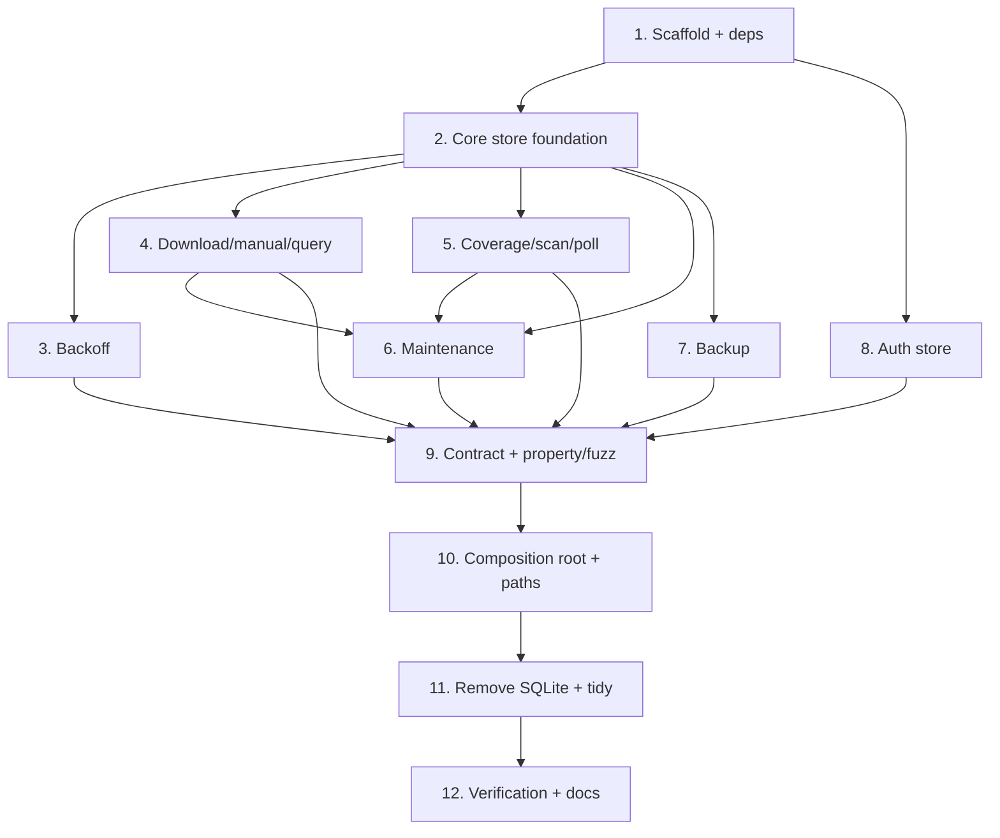

# Implementation Plan

## Overview

Build the new store packages in parallel with the old SQLite ones, prove them against engine-agnostic contract suites, then swap the composition root and delete SQLite in one late, gated step. Each task is behaviour-preserving at the `api.Store` and `authstore.AuthStore` seams.

## Tasks

- [ ] 1. Scaffold packages and dependencies
  - [ ] 1.1 Add `go.etcd.io/bbolt` (the only new dependency; it pulls only `golang.org/x/sys`, already present). Durable auth lives in bbolt buckets in the same file, so no auth-specific library is needed. Leave `internal/fsutil` untouched (it keeps its role for user-path-derived subtitle writes).
    - _Requirements: 1.4, 9.1_
  - [ ] 1.2 Extract `internal/store/kv` (boltkv) leaf package holding the shared versioned-JSON codec, key encoders (`be64`, `0x00`-join, time-index), the `NextSequence` id helper, and the generic index-maintenance helper (`putIndexed` / `deleteIndexed` taking declared `indexSpec`s; an `indexSpec` may carry a projected value, and the helper also maintains declared `meta` counters in the same tx). Both `store` and `authstore` depend on it; the dependency DAG is `api <- boltkv <- {store, authstore} <- {main, cli}`.
    - _Requirements: 8.1, 18.5_
  - [ ] 1.3 Create `internal/store` and `internal/authstore` package skeletons with `Open`/`Close` stubs and compile-time assertions `var _ api.Store = (*store.DB)(nil)` and `var _ authstore.AuthStore = (*authstore.Store)(nil)`. The core store owns the `*bbolt.DB`; the auth store shares the handle and owns only its ephemeral maps and sweeper (its `Close` never closes the handle).
    - _Requirements: 11.1_

- [ ] 2. Core store foundation
  - [ ] 2.1 Implement `keys.go`: composite-key build/parse with the `0x00` separator, big-endian surrogate-id and time-index encoders, and prefix builders; unit-test byte-order preservation and component-boundary safety.
    - _Requirements: 8.2, 8.3_
  - [ ] 2.2 Implement `codec.go`: versioned JSON value encode/decode with `core_schema_version` and `auth_schema_version` kept as separate `meta` keys (independent evolution). Decode is tolerant-skip-with-warning for derived core buckets, but FAILS CLOSED for auth buckets and lock/uniqueness reads. Fuzz the decoder against arbitrary bytes.
    - _Requirements: 13.4_
  - [ ] 2.3 Implement `store.go`: `Open` with mode `0o600` and `Options{Timeout: 5s}` (fail fast on a held lock), bootstrap of all core AND auth buckets in one `Update` (the core store is the single bucket-schema owner), and `Close` (closes the handle). Add a test asserting the file mode is `0600`.
    - _Requirements: 1.3, 9.1, 13.2_
  - [ ] 2.4 Implement `index.go`: helpers that maintain each secondary-index bucket in the same `Update` as its primary (read-old, delete-stale, write-new, add-fresh); add a property test asserting every index equals a full primary re-scan after random operation sequences.
    - _Requirements: 8.1_

- [ ] 3. Backoff domain (`attempts.go`)
  - [ ] 3.1 Implement `RecordNoResult` (compute `next_retry` from `BackoffParams`, maintain `ix_attempts_due`) and `BackedOffProviders` (threshold OR future-retry; max-attempts <= 0 means only the retry check), with the no-row-means-eligible behaviour.
    - _Requirements: 2.1, 2.2, 2.4_
  - [ ] 3.2 Implement `GetBackoffItems` (ascending `next_retry` via the due index) and `GetBackoffByPrefix` (provider rows only, ordered media id then ascending `next_retry`).
    - _Requirements: 2.3, 15.4_

- [ ] 4. Download, manual lock, history, and query domain (`substate.go`)
  - [ ] 4.1 Implement `SaveDownload`: auto-row upsert preserving `media_imported` (insert with now when absent), manual-row append with the ordinal parsed from `rec.Path`, and clearing the triple's `search_attempts` (and due index) in the same transaction.
    - _Requirements: 3.1, 3.2, 3.3, 4.5_
  - [ ] 4.2 Implement `CurrentScore` (highest auto-row score and that row's `media_imported`, found flag false when none) and `DownloadedRefs` (distinct `(release_name, provider)` pairs, excluding empty release names).
    - _Requirements: 3.4, 3.5_
  - [ ] 4.3 Implement manual-lock methods: `IsManuallyLocked`, `ClearManualLock` as a non-destructive flag flip preserving the rows, `ManualDownloadCount`, `ManualSubtitlePaths`, `NextManualNumber` (max manual ordinal + 1). Serve `IsManuallyLocked` / `ManualDownloadCount` from the `ix_state_triple` projection (`manual`) without dereferencing primaries.
    - _Requirements: 4.1, 4.2, 4.3, 4.4, 15.6, 18.3_
  - [ ] 4.4 Implement `GetState` (filter by type/language/provider, contains-match title search with `%`/`_`/`\` escaped, default 1000-row cap, sort `media_imported DESC` then surrogate-id DESC, keyset pagination over `ix_state_imported` for deep pages with numeric offset retained for shallow callers), `Stats` (O(1) maintained counters), `GetManualLocks` (one per locked triple with count, ordered), and `HistoryMediaIDs` (distinct).
    - _Requirements: 8.4, 15.1, 15.2, 15.3, 15.5, 18.1, 18.4_

- [ ] 5. Coverage, scan-state, sync-offset, and poll domains
  - [ ] 5.1 Implement `subfiles.go`: `RecordSubtitleFiles` diff-sync (insert/update/delete stale, report changed), `UpsertSubtitleFile`, `DeleteSubtitleFile`, `GetSubtitleFiles`, and `TotalSubtitleFiles` from an O(1) maintained `meta` counter. Compute per-media coverage from `subtitle_files` keys (lang/variant are in the key) without decoding values.
    - _Requirements: 5.1, 5.2, 5.5, 15.7, 18.1, 18.2_
  - [ ] 5.2 Implement `scanstate.go`: `RecordScanState` (upsert + `ix_scan_at`), `GetScanStates`, `RecentlyScanned` (inclusive cutoff via the scan index), `LastScanTime` formatted `"YYYY-MM-DD HH:MM:SS"` UTC or empty.
    - _Requirements: 5.3, 5.4, 5.6_
  - [ ] 5.3 Implement `SyncOffsetStore` (set/get by path) and `pollstate.go` (`PollKey` get/set, zero time when absent).
    - _Requirements: 6.1, 6.2, 6.3_

- [ ] 6. Maintenance domain (`maint.go`)
  - [ ] 6.1 Implement `DeleteStateByPaths`: prefix-scan `ix_state_video` per path (a video backs several rows), delete the rows and index entries, orphaned subtitle files, affected triples' backoff, and scan-state for media left with no state, in bounded transactions.
    - _Requirements: 7.6_
  - [ ] 6.2 Implement `CleanupDrift`: delete backoff for removed languages/providers, and clear all backoff when adaptive search is disabled.
    - _Requirements: 7.7, 7.8_
  - [ ] 6.3 Implement `ReconcileState` three-way and group-aware: video gone deletes row/orphans/backoff/scan-state; subtitle gone with another present deletes only that row (preserve lock, no reset, no backoff clear); all subtitles gone resets auto rows, deletes manual rows, and clears backoff. Execute in bounded `Update` batches; ensure each operation is idempotent.
    - _Requirements: 7.1, 7.2, 7.3, 7.4, 7.5_

- [ ] 7. Backup (`backup.go`)
  - [ ] 7.1 Implement `BackupInto` using a bbolt read-transaction `tx.WriteTo` snapshot of the single file (core plus auth buckets), one consistent hot backup. `WriteTo` is NOT a compactor (it copies live and free pages); reclaiming disk is a separate `bbolt.Compact` step. Name backup artifacts `subflux-<ts>.bolt` (update the prune glob in `internal/server/backup.go`) and document the restore procedure (stop container, copy a snapshot over `/config/subflux.bolt`, restart); point Kopia at the snapshot directory, not the live mmap'd file.
    - _Requirements: 11.1_

- [ ] 8. Auth store (`internal/authstore`)
  - [ ] 8.1 Implement `authdb.go`: the `Store` type wrapping the shared `*bbolt.DB` plus the in-memory ephemeral maps; bootstrap the `auth_users` / `auth_passkeys` / `auth_api_keys` buckets and their index buckets. Durable mutations run as a single `Update` (uniqueness check, put, index maintenance), crash-durable on commit; absent buckets mean an empty first boot, and a corrupt file fails open with a descriptive error.
    - _Requirements: 9.1, 9.2, 9.6_
  - [ ] 8.2 Implement `users.go`: create/update/delete over `auth_users` with cascade to passkeys, keys, and sessions in one `Update`; case-insensitive username and email lookups; `UserCount`; uniqueness on username and `(oidc_issuer, oidc_sub)` checked against the index buckets.
    - _Requirements: 9.3, 9.4, 16.1, 16.2_
  - [ ] 8.3 Implement `passkeys.go`: create, lookups by user and credential id, `RenamePasskey`, `PasskeyCountForUser`, `DeletePasskey` with an ownership check, and `UpdatePasskeyAfterLogin` persisting a durable, monotonic `sign_count`.
    - _Requirements: 9.5, 16.4, 16.6, 16.7_
  - [ ] 8.4 Implement `apikeys.go`: create with hash uniqueness, `GetAPIKeyByHash`, `ListAPIKeysByUserID`, `DeleteAPIKey` with an ownership check.
    - _Requirements: 16.4, 16.6, 16.7_
  - [ ] 8.5 Implement `sessions.go` (in-memory): create, get-by-hash, single and batch activity updates (memory only), delete, `DeleteUserSessions` with a keep-one exception, and `CleanupExpiredSessions` honouring idle and absolute timeouts.
    - _Requirements: 10.1, 10.2, 16.5, 16.7_
  - [ ] 8.6 Implement `oidcstates.go` (in-memory): create and single-use `ConsumeOIDCState` (second consume returns not-found), plus expiry cleanup.
    - _Requirements: 16.3_
  - [ ] 8.7 Implement `sweeper.go`: a background goroutine started in `Open` and stopped in `Close` that evicts expired sessions and OIDC states within one bounded interval of expiry.
    - _Requirements: 10.3, 10.4_

- [ ] 9. Contract suites and property/fuzz coverage
  - [ ] 9.1 Promote the substantive assertions from the SQLite-coupled `store_contract_test.go` and `store_maint_reconcile_test.go` into the engine-agnostic `storetest` suite (strengthen no-error checks to exact-value checks), and run it against `*store.DB`. Pin each resolved finding as a NAMED test: the three reconcile branches, non-destructive `ClearManualLock`, backoff cleared on save, `DeleteStateByPaths` orphan cleanup, `GetState` filter/search/limit/offset, AND both `CleanupDrift` branches (removed-langs/providers, requirement 7.7, and adaptive-disabled, 7.8). Add an assertion that the suite fails against a deliberately broken stub.
    - _Requirements: 14.1, 14.2_
  - [ ] 9.2 Add an `authstore.AuthStore` contract suite covering uniqueness, user-delete cascade, `sign_count` durability across reopen, single-use `ConsumeOIDCState`, credential ownership checks, and idle/absolute session expiry.
    - _Requirements: 14.1, 14.2_
  - [ ] 9.3 Add property and fuzz tests: index-equals-rescan invariant (op alphabet incl. SaveDownload, RecordNoResult, RecordSubtitleFiles, RecordScanState, ClearManualLock, DeleteStateByPaths, ReconcileState, keys from a small pool to force collisions/deletes), asserting index keys, any projected index value, and the maintained `meta` counters all equal a full primary re-scan; key encode/parse + be64 ordering, and codec round-trip vs malformed-decode as separate properties. Add query-level tests for prefix-collision (`tt1` must not return `tt12`), ascending `next_retry` ordering, and inclusive `RecentlyScanned` cutoff. Add a fault-injection test (abort the `Update` after the primary put, before the index put; assert read-back sees neither), a reconcile-convergence test (run the pass in two halves; assert equality with one uninterrupted pass), and a concurrent-workload test (poller `SaveDownload` goroutine while `ReconcileState` runs) under `-race`.
    - _Requirements: 14.3, 18.5_
  - [ ] 9.4 Add a differential-parity test BEFORE task 11 (while both engines still compile): a `pgregory.net/rapid` state machine driving the same operation sequence through the old SQLite `store.DB` and the new bbolt store, asserting equal observable output for every read method (covers the `media_imported DESC, id DESC` tiebreak, `DownloadedRefs` distinct-non-empty, `LIKE ESCAPE` title search, and the reconcile branch outcomes). This is the real parity oracle; the contract suite alone only proves conformance.
    - _Requirements: 14.1_

- [ ] 10. Composition root and paths
  - [ ] 10.1 Update config: change `DefaultDBPath` to `/config/subflux.bolt` (no separate auth path; auth lives in buckets in the same file).
    - _Requirements: 12.1_
  - [ ] 10.2 Update `main.go`: open one bbolt DB via `store.Open`, build the core store and `authstore.New(db)` over the shared handle, pass the core store to `server.New` and the auth store to `srv.SetAuth`, update the compile-time interface assertions, and keep the unconfigured-mode path working.
    - _Requirements: 11.2, 11.3_
  - [ ] 10.3 Route the auth CLI commands (`reset-password`, `generate-api-key`, `enable-password-login`) through the running server over HTTP (add a first-boot/localhost-guarded admin-bootstrap endpoint) instead of opening the bbolt file in-process; bbolt's exclusive OS lock makes a direct open collide with the always-running server (a regression from SQLite's multi-process open). Update `cli.go` accordingly.
    - _Requirements: 11.2, 12.3_

- [ ] 11. Remove SQLite and tidy
  - [ ] 11.1 Delete the old store packages (`store/{authdb,coveragedb,migrations,reconcile,txutil}` and the SQLite `store/*.go`), remove `modernc.org/sqlite` from `go.mod`, and run `go mod tidy` so the modernc/humanize/bigfft/strftime modules drop out.
    - _Requirements: 1.1, 1.2_
  - [ ] 11.2 Confirm `go build ./...` and `go vet ./...` pass, the build stays `CGO_ENABLED=0`, and the binary is smaller than the SQLite build.
    - _Requirements: 1.5_

- [ ] 12. Verification and documentation
  - [ ] 12.1 Run unit, contract, property, fuzz, and race suites, then run `tests/functional/run.sh` against the new binary as the behavioural gate.
    - _Requirements: 14.4_
  - [ ] 12.2 Update steering (`subflux-store.md`, `subflux.md`) and write release notes documenting the clean-break, no-migration cutover: ignored old `subflux.db`, rebuild-on-first-scan, and the lost manual locks, manual history, and sync offsets.
    - _Requirements: 12.4, 12.6_
  - [ ] 12.3 Add store observability: metrics for file size and freelist bytes (`DB.Stats()` / `Tx.Size()`), reconcile progress, and backup success timestamp/duration; raise a persistent alert on repeated `Update` failure (disk-full) instead of crash-looping; keep reconcile start/finish INFO logs.
    - _Requirements: 17.1, 17.2, 17.3, 17.4_
  - [ ] 12.4 Write the operability runbooks: corrupt-file recovery (stop, move `subflux.bolt` aside, restart, rebuild on scan, recreate auth), `bbolt.Compact` procedure for file-growth reclaim with a size/freelist trigger, and a host-kernel check (ext4 fast_commit fixed in 5.10.94+/5.15.17+) in the cutover checklist.
    - _Requirements: 13.1, 17.1_

## Task Dependency Graph



Critical path: 1 -> 2 -> (3,4,5) -> 6 -> 9 -> 10 -> 11 -> 12. Tasks 3 through 8 parallelize once their prerequisites are met; the SQLite removal (11) is deliberately gated behind a green contract + composition swap (9, 10) so the tree always compiles.

```json
{
  "waves": [
    { "wave": 1, "tasks": ["1"], "description": "Scaffold packages, add bbolt" },
    { "wave": 2, "tasks": ["2", "8"], "description": "Core store foundation and the independent auth store" },
    { "wave": 3, "tasks": ["3", "4", "5", "7"], "description": "Core domains and backup on top of the foundation" },
    { "wave": 4, "tasks": ["6"], "description": "Maintenance, which depends on the download and coverage domains" },
    { "wave": 5, "tasks": ["9"], "description": "Contract, property, and fuzz suites against the new stores" },
    { "wave": 6, "tasks": ["10"], "description": "Composition-root swap and path constants" },
    { "wave": 7, "tasks": ["11"], "description": "Delete SQLite packages and tidy go.mod" },
    { "wave": 8, "tasks": ["12"], "description": "Full verification and documentation" }
  ]
}
```

## Notes

- The old `internal/store/**` packages stay in place and compiling until task 11; the new packages are built alongside under the same import path plan, and the compile-time interface assertions (task 1.2) catch contract drift early.
- The auth-store tests that exercise the atomic durable write run on Linux/CI; the dev workstation is Windows, so run the auth suite in WSL or CI.
- No deployment, image publish, or Komodo step is part of this plan; cutover behaviour (ignored old `subflux.db`, rebuild on first scan) is covered by tasks 10.1 and 12.2 and the release notes, and is exercised by the functional suite (12.1).
- This is a clean break: there is no migration task because there is no migration (requirement 12). Reviewers should test task 7.x reconcile against the corrected three-way semantics, not the prior single-transaction behaviour.
